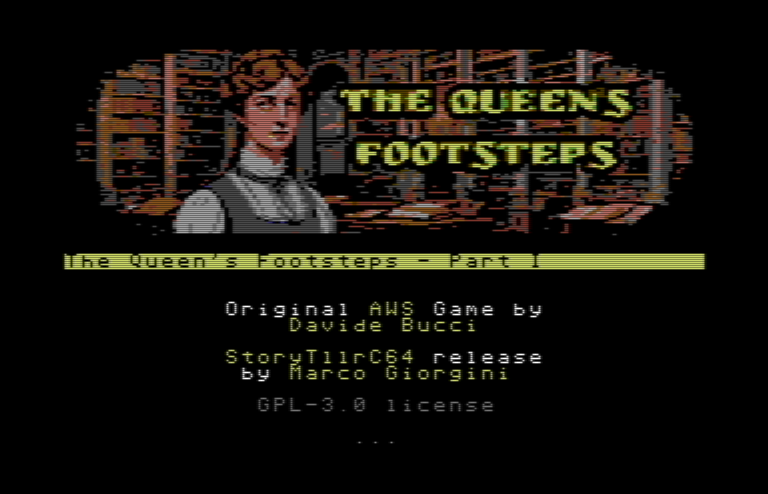

# The Queen's Footsteps - Part 1

**StoryTllr64** port of **Davide Bucci**'s [text adventure masterpiece](https://github.com/DarwinNE/The-Queen-s-Footsteps) (written in [AWS](https://github.com/DarwinNE/aws2c))

You can find other info about his game [here](http://davbucci.chez-alice.fr/index.php?argument=varie/queen/queen.inc&language=English)

## About this conversion

This conversion was possible because the original game has been released as **GPL 3.0**. I loved the original game, and I wanted not only to see how "solid" is my text-adventure little [engine](https://github.com/MGProduction/StoryTllr) but also to really study Davide's work, to learn from one of his most famous works.

## Where are the other parts of this adventure?

I have no plans to port the other two parts - but from the original author's page, there are several versions of them (including a C64 one), of course done with his engine of choice. His license allows you to port even them in any other system you like (including mine, even if I'm aware that's a far-fetched possibility)

## Differences with the original one

The two script languages (mine and AWS) are quite different in several aspects, so there's a (I hope minimal) set of differences that just depends on the engines' features. Apart from that, and from the fact that I added graphics to locations, this game should be identical to the original one. I mean, you can follow Davide's walkthrough step by step and reach the end.

## How to build this game?

If you've got a Windows machine (and you need it for building) you simply have to run **run.bat** - but you also need **c1541.exe** (a [VICE Emulator](https://vice-emu.sourceforge.io/index.html#download) tool) to go from built files to **.d64**

**StoryTllr** engine - **MIT Licence** - is anyway available [here](https://github.com/MGProduction/StoryTllr).

## How to edit this game?

Game source files are in **Treepad format** - [TreepadLite](https://www.portablefreeware.com/index.php?id=1734) isn't supported anymore but it still freely (and legally) available (and there's also a jar similar tool able to handle its format), so you can download it, and edit game.htj or stdlib.hjt files with that. OR you can work with yaml like corresponding files (game.txt and stdlib.txt) in tmp subfolder. The compiler read hjt files, convert them in txt and then compile THOSE so you can use them directly if you prefer.

## Licence

The original game has been released as **GPL 3.0** - so this conversion follows the same route. You can do with game code (and gfx too) everything that's covered by that license.
